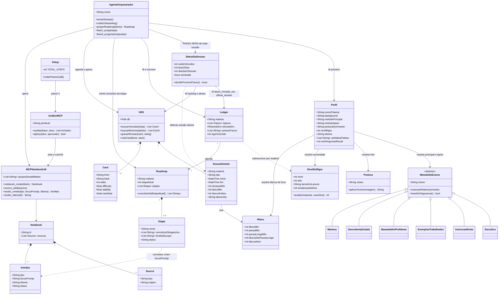
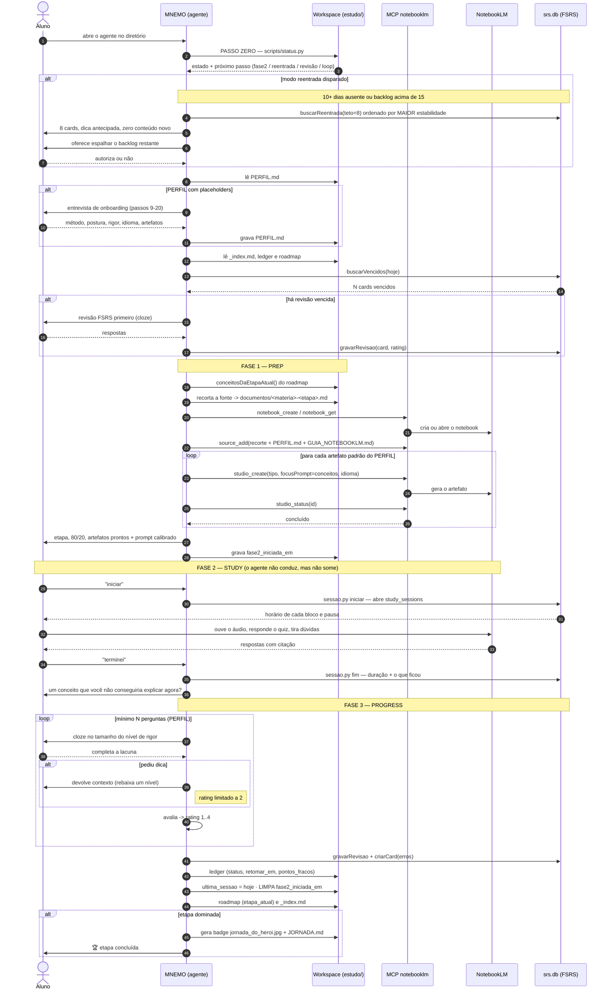

# Arquitetura de Estudo — Orquestrador + NotebookLM + FSRS

> Como as peças conversam para transformar qualquer fonte (PDF/slides/apostila) em aprendizado com retenção de longo prazo. O **agente orquestrador** (Claude Code ou Antigravity CLI) prepara material no **NotebookLM**, você estuda lá, e o **workspace** guarda o progresso.

---

## 1. Visão geral — quem é quem

O workspace tem **duas metades com regras opostas**: a raiz é *harness* (versionada) e
`estudo/` é *conteúdo* (ignorada pelo git). Ver `AGENTS.md` → "Onde escrever cada coisa".

```
┌─────────────────────────────────────────────────────────────────────────┐
│  WORKSPACE                                                              │
│                                                                         │
│  ▲ HARNESS (versionado) ─ como o sistema funciona                       │
│    .agents/skills/professor/SKILL.md  ← O CÉREBRO (persona + 3 fases)   │
│    METODOS_DE_ENSINO.md               ← 6 métodos · rigor DOK · posturas│
│    GUIA_NOTEBOOKLM.md                 ← persona/método (vira source)    │
│    .agents/mcp_config.json            ← MCP com privilégio mínimo       │
│    .agents/mcp_pin.json               ← commit auditado do MCP          │
│    scripts/                           ← setup · auditoria · progresso   │
│                                                                         │
│  ▼ estudo/ (ignorado) ─ quem você é e o que estudou                     │
│    PERFIL.md                          ← método, postura, rigor, idioma  │
│    documentos/<fonte>.pdf             ← conteúdo bruto                  │
│    documentos/<materia>-<etapa>.md    ← RECORTE curado da etapa         │
│    progresso/<materia>.md             ← LEDGER (estado + 80/20 + log)   │
│    progresso/<materia>-roadmap.md     ← TRILHA (etapas + conceitos)     │
│    progresso/srs.db                   ← FSRS = fonte da verdade         │
└─────────────────────────────────────────────────────────────────────────┘
                                   │
                    ┌──────────────┴───────────────┐
                    │   AGENTE ORQUESTRADOR         │  ← lê a skill + o perfil
                    │   "MNEMO"                     │     + o ledger + o roadmap
                    └──────────────┬───────────────┘
                                   │  (protocolo MCP)
                    ┌──────────────┴───────────────┐
                    │  MCP  "notebooklm"            │  pinado num commit auditado
                    │  • grupos: notebooks,         │  • conta Google DEDICADA
                    │    sources, studio, chat, auth│  • cookie 0600, local só
                    │  • sharing/automation OFF     │  • fala só com google.com
                    └──────────────┬───────────────┘
                                   │  (dirige sua sessão real)
                    ┌──────────────┴───────────────┐
                    │   NOTEBOOKLM  (conta dedicada)│  ← onde VOCÊ estuda
                    │   áudio · quiz · infográfico  │
                    │   mapa mental · slides        │
                    └───────────────────────────────┘
```

---

## 2. Diagrama de classes — a estrutura

Como as peças se relacionam. O `Perfil` é a peça central de configuração: é ele que
resolve *qual* método, *qual* postura e *qual* rigor o agente usa em tempo de execução.



> **A relação que segura tudo:** `Etapa ..> Artefato`. Os conceitos obrigatórios da etapa
> atual entram no `focusPrompt` de **todo** artefato gerado. É esse trilho que impede o
> NotebookLM de avançar para conteúdo de etapas futuras.

---

## 3. Diagrama de sequência — uma sessão de estudo

Do "oi" até o card agendado. Note o **corte no meio**: a Fase 2 acontece fora do sistema,
e o agente fica parado esperando o aluno voltar.



---

## 4. Diagrama de atividade — do setup ao loop

O caminho completo, com as decisões. Os losangos são onde o sistema **para e pergunta**.

```mermaid
flowchart TD
    Start([Aluno abre o agente]) --> A0[/Agente lê AGENTS.md/]
    A0 --> Q1{PERFIL.md existe<br/>e está completo?}

    Q1 -- não --> S1[Passos 1-8: scripts/setup.py<br/>uv · clone · auditoria · pin<br/>estudo/ · privilégio mínimo]
    S1 --> S2{Sessão do Google<br/>já é válida?}
    S2 -- não --> S3[Passo 8: abre o navegador<br/>aluno autentica]
    S3 --> S4{nlm doctor<br/>confirma?}
    S4 -- não --> S3
    S4 -- sim --> S5
    S2 -- sim --> S5[Passos 9-20: entrevista<br/>método · postura · rigor<br/>idioma · artefatos]
    S5 --> S6[/Grava estudo/PERFIL.md/]
    S6 --> Q2

    Q1 -- sim --> Q2{MCP conectado?}
    Q2 -- não --> S1
    Q2 -- sim --> ST[/PASSO ZERO<br/>python3 scripts/status.py/]

    ST --> D0{Qual o próximo passo<br/>que o script apontou?}
    D0 -- reentrada --> RE[MODO REENTRADA<br/>teto de 8 cards · maior estabilidade primeiro<br/>dica antecipada · zero conteúdo novo]
    RE --> RE2{Espalhar o backlog<br/>restante?}
    RE2 -- só com autorização --> RE3[/Reagenda due_date<br/>e registra no log/]
    RE2 -- não --> End
    RE3 --> End

    D0 -- fase2 pendente --> W
    D0 -- revisão vencida --> R2[Revisão espaçada primeiro<br/>cloze + rating + novo intervalo]
    D0 -- sem matéria --> N1
    D0 -- seguir o loop --> R1
    R2 --> R1

    N1[Aluno põe a fonte<br/>em estudo/documentos/]
    N1 --> N2[Agente propõe roadmap<br/>4 a 8 etapas + conceitos]
    N2 --> N3{Aluno aprova<br/>o roadmap?}
    N3 -- não --> N2
    N3 -- sim --> N4[/Grava roadmap + ledger<br/>e registra no _index/]
    N4 --> R1

    R1[FASE 1 — PREP] --> P1[Extrai conceitos<br/>da etapa atual]
    P1 --> P2[Recorta a fonte para<br/>documentos/materia-etapa.md]
    P2 --> P3[source_add: recorte<br/>+ PERFIL + GUIA]
    P3 --> P4[studio_create de cada artefato<br/>focusPrompt = conceitos da etapa]
    P4 --> P5[/Avisa o aluno + entrega<br/>o prompt calibrado/]
    P5 --> P6[/Grava fase2_iniciada_em<br/>no ledger/]

    P6 --> F2[FASE 2 — STUDY<br/>aluno consome no NotebookLM]
    F2 --> T1{Aluno disse<br/>iniciar?}
    T1 -- sim --> T2[sessao.py iniciar<br/>blocos de foco do PERFIL]
    T1 -- não --> W
    T2 --> W{Aluno voltou?}
    W -- não, e passou de 3 dias --> V1[status.py aponta<br/>fase2 pendente na próxima sessão]
    W -- não, e passou de 7 dias --> V2[status.py declara expirada:<br/>recall assim mesmo ou regenerar]
    V1 --> F3
    V2 --> F3
    W -- sim --> T3[sessao.py fim<br/>grava duração + o que ficou]
    T3 --> F3[FASE 3 — PROGRESS]

    F3 --> G1[Recall em cloze progressivo<br/>no tamanho do nível de rigor]
    G1 --> G2{Pediu dica?}
    G2 -- sim --> G3[Devolve contexto<br/>rating limitado a 2]
    G2 -- não --> G4
    G3 --> G4[Avalia: rating 1-4]
    G4 --> G5{Cobriu o mínimo<br/>de perguntas?}
    G5 -- não --> G1
    G5 -- sim --> G6[/Grava FSRS · ledger · roadmap · log<br/>atualiza ultima_sessao<br/>LIMPA fase2_iniciada_em/]

    G6 --> G7{Etapa dominada?}
    G7 -- não --> G8[Reforça pontos fracos<br/>na próxima sessão]
    G7 -- sim --> G9[Gera badge + JORNADA.md<br/>avança etapa_atual]
    G8 --> End
    G9 --> End([Fim da sessão])

    classDef decisao fill:#e67e22,stroke:#d35400,color:#fff;
    classDef fase fill:#2ecc71,stroke:#27ae60,color:#fff;
    classDef alerta fill:#8C2F1F,stroke:#6d2417,color:#fff;
    class Q1,Q2,S2,S4,N3,D0,W,T1,G2,G5,G7,RE2 decisao
    class R1,F2,F3 fase
    class RE,V2 alerta
```



> **Por que o passo zero é um script e não uma instrução.** O gatilho da Fase 2 abandonada e o modo reentrada são exatamente o tipo de verificação que um agente com o contexto cheio deixa de fazer — e a falha é silenciosa, porque ninguém sente falta de uma checagem que não aconteceu. Tirando a decisão da memória do agente e colocando numa saída de terminal, ela passa a acontecer mesmo quando ele está distraído.

---

## 5. O loop de 3 fases (resumo textual)

```
  PASSO ZERO  (script, antes de qualquer coisa)
  ─────────────────────────────────────────────────────────────
  python3 scripts/status.py
      → cards vencidos · Fase 2 aberta há N dias · dias sem sessão
      → decide: reentrada | fase2 pendente | revisão | loop
      (o agente segue o que o script apontar, não o que ele lembrar)

  FASE 1 — PREP  (agente faz, sozinho)
  ─────────────────────────────────────────────────────────────
  lê ledger → retomar_em + pontos_fracos
  lê roadmap → conceitos obrigatórios da etapa + fora de escopo
      │
      ▼
  extrai do material bruto só o conteúdo da etapa
      → estudo/documentos/<materia>-<etapa>.md
      │
      ▼
  garante notebook → sobe o recorte + PERFIL.md + GUIA_NOTEBOOKLM.md
      → gera os artefatos do conjunto padrão do PERFIL
        (todo focus_prompt leva a lista de conceitos + a proibição de avançar)
      │
      ▼
  avisa: "etapa X, o 80/20 é Y, material pronto" + prompt calibrado pro chat

  FASE 2 — STUDY  (VOCÊ faz)
  ─────────────────────────────────────────────────────────────
  você diz "iniciar" → sessao.py cronometra em blocos de foco
  NotebookLM: áudio no deslocamento · quiz · dúvidas com citação
  você volta → sessao.py fim
      │
      ▼  se você NÃO voltar:
  3 dias  → a próxima sessão COMEÇA por aqui
  7 dias  → o material é dado como não consumido
            (recall assim mesmo, ou regenerar)

  FASE 3 — PROGRESS  (agente faz, escrevendo no workspace)
  ─────────────────────────────────────────────────────────────
  recall em cloze progressivo, no mínimo N perguntas (PERFIL)
      │
      ├─► ledger: status, retomar_em, pontos_fracos
      ├─► ledger: ultima_sessao ← hoje · fase2_iniciada_em ← vazio
      ├─► srs.db: rating 1-4 + FSRS → próxima data
      ├─► roadmap: etapa_atual + status da etapa
      ├─► cards novos (dos erros) + linha no Log
      └─► etapa dominada → badge jornada_do_heroi.jpg + JORNADA.md
```

> **Regra fixa:** o recall da Fase 3 é **produção ativa**, não reconhecimento — mesmo que o quiz do NotebookLM já tenha sido feito. Formato e severidade saem do nível de rigor (`METODOS_DE_ENSINO.md` §2).

> **Único elo manual:** o resultado do quiz nasce *dentro* do NotebookLM e o MCP não lê esse "mastery" de forma confiável. Então na Fase 3 **você reporta** o placar/o que travou — o agente faz o resto.

---

## 6. Responsabilidades — cada peça faz uma coisa

| Peça | Papel | Por que é ela |
|---|---|---|
| **Agente orquestrador** | Conduz o loop, lê/escreve arquivos | Agente com acesso ao workspace |
| **`scripts/status.py`** | Passo zero: decide por onde a sessão começa | Gatilho que **não** pode depender da memória do agente |
| **`scripts/sessao.py`** | Cronômetro em blocos de foco | Tempo medido por relógio, não por estimativa de conversa |
| **`SKILL.md`** | O "cérebro": persona, 80/20, as 3 fases | Instruções que o agente segue |
| **`METODOS_DE_ENSINO.md`** | Roteiro de cada método, escala de rigor, posturas | O *como ensinar* configurável |
| **`PERFIL.md`** | Resolve método/postura/rigor/idioma em runtime | Fonte única de configuração |
| **`<materia>-roadmap.md`** | Trilha e conceitos obrigatórios por etapa | O trilho anti-desvio |
| **MCP `notebooklm`** | Ponte código→NotebookLM (criar/subir/gerar) | Único caminho sem API oficial |
| **NotebookLM** | Superfície de estudo (áudio/quiz/consumo) | O forte dele: consolidar a fonte |
| **`srs.db` (FSRS)** | Fonte da verdade do progresso + timing | Repetição espaçada de verdade |
| **`<materia>.md`** | Estado da matéria + 80/20 + log + fracos | Memória que sobrevive entre sessões |

---

## 7. Guardrails de segurança embutidos

- MCP **pinado** num commit auditado (`.agents/mcp_pin.json`) · roda de um clone local em `vendor/`, não do PyPI "latest".
- **Atualização auditada:** `scripts/mcp_update.py` lê o diff antes de aplicar. Achado de severidade ALTA (execução dinâmica, shell, desserialização insegura, import dinâmico) **bloqueia** o `--apply`. Dependências novas e arquivos sensíveis são sinalizados.
- **Conta Google dedicada** → se o cookie vazar, expõe só seus materiais de estudo.
- **Privilégio mínimo** (`.agents/mcp_config.json`): `sharing` e `automation` desligados. O setup **falha** (passo 7) se alguém religar.
- Cookie **local**, permissão `0600` no Linux/macOS; no Windows a proteção é a ACL do perfil.
- **Fronteira do repo:** `estudo/` é ignorado — perfil, progresso e fontes nunca vão para o git, mesmo por acidente.

---

## 8. Multiplataforma

Todo o setup é um único `scripts/setup.py` (Python 3.9+, biblioteca padrão apenas), que
resolve as diferenças de sistema em tempo de execução:

| Aspecto | Linux / macOS | Windows |
|---|---|---|
| Comando | `python3 scripts/setup.py` | `py scripts\setup.py` |
| Instalador do `uv` | `curl … install.sh \| sh` | `powershell -ExecutionPolicy ByPass -c "irm … install.ps1 \| iex"` |
| `PATH` do binário | `~/.local/bin` | `%USERPROFILE%\.local\bin` |
| Permissão do cookie | `chmod 0600` | ACL do perfil do usuário (avisado no log) |
| Acentos e barra | UTF-8 nativo | `reconfigure(utf-8)` + fallback ASCII se o console não suportar |
| Cores ANSI | nativo | habilitado via `SetConsoleMode` (Windows 10+) |
