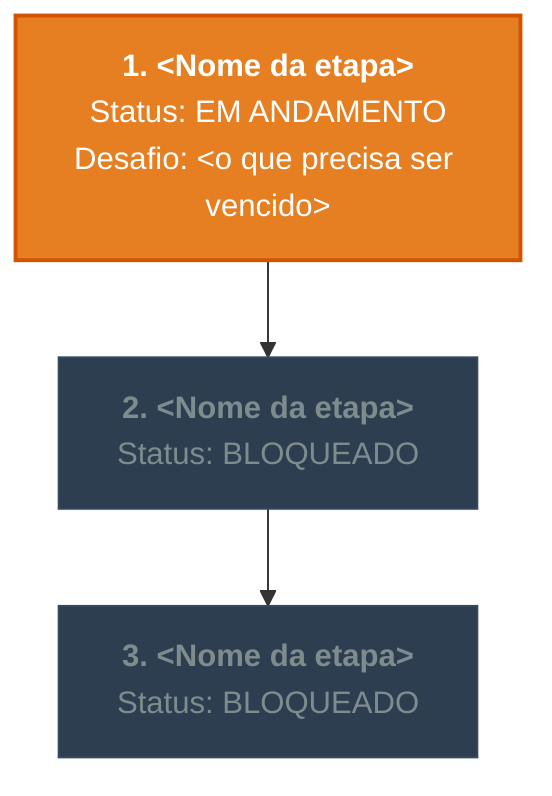

# 🛡️ A Jornada — <Nome da Matéria>

> Mapa visual da sua jornada nesta matéria. O agente atualiza este arquivo e o badge a
> cada etapa dominada no roadmap (Fase 3 → passo 5 da `SKILL.md`).
>
> **Este arquivo é conteúdo de estudo** — vive em `estudo/` e nunca vai para o git.

---

## 📊 Progresso geral: 0% concluído

---

## ⚔️ Diário de conquistas

<!-- Um bloco por etapa dominada. Mais recente em cima. -->

### 🟢 Etapa 1 — <Nome da etapa>
*   **Concluída em:** AAAA-MM-DD
*   **Conceitos dominados:**
    *   `<Conceito>`: <o que o aluno demonstrou entender no recall>

---
*(Atualizado pelo orquestrador a cada marco concluído no ledger.)*
